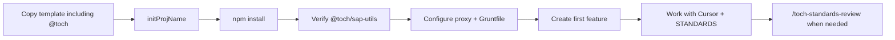

# For First Timers

A short onboarding guide for starting a new project from the TOCH Angular 20 template.

---

## Before you start

```bash
npm run initProjName    # Step 1 — rename the project
npm install             # Step 2 — run from the repo root
npm start               # English (source locale) + dev environment
npm run start:he        # Hebrew UI + dev environment
```

> **Important:** Make sure the `@toch/sap-utils/` folder was copied with the template (see [section 4](#4-tochsap-utils-local-package)).

---

## 1. `initProjName` — rename the project

### What it does

The script [`scripts/initProjName.js`](scripts/initProjName.js) asks for a new name and replaces `angular-20-template` in the core config files.

```bash
npm run initProjName
```

Enter a name in **kebab-case** (lowercase letters, hyphens, e.g. `my-app`).

### Which files are updated?

| File | What changes |
|------|----------------|
| `package.json` | `name` field |
| `package-lock.json` | `name` field |
| `angular.json` | project name + build targets |
| `README.md` | project name and `dist/` path mentions |
| `Gruntfile.js` | `dist/<name>/browser/he` path |
| `STANDARDS.md` | `Template: ...` header line |
| `reference/01-meta-versions-structure.md` | `Template: ...` header line |

### Good to know

- Review the diff before committing — the script does **not** update `proxy.config.json` or the title in `index.html`.
- If nothing would change, the script prints `No changes` and does not rewrite files.
- Valid: `my-project`, `receipts-ui`  
  Invalid: `MyProject`, `my_project`, `123-app`
- `initProjName` does **not** touch `@toch/` — only config files.

### Copying the template to a new folder

When copying manually (not `git clone`), copy the **entire** repo root, including:

```
@toch/sap-utils/     ← required
.cursor/
scripts/
src/
package.json
...
```

#### Two different folders named `dist`

The template has two unrelated `dist` folders:

| Path | Purpose | Keep when copying? |
|------|---------|-------------------|
| `dist/` at repo root | Angular **build output** (from `ng build`) | No — recreated on build |
| `@toch/sap-utils/dist/` | **Runtime source** of the local SAP package | **Yes** — required for `ng serve` |

#### Copy pitfalls (Windows)

`robocopy ... /XD dist` excludes **every** folder named `dist` in the tree — not only the root one. That silently removes `@toch/sap-utils/dist/`. `npm install` may still succeed, but `ng serve` fails with errors like:

```
TS2614: Module '"@toch/sap-utils"' has no exported member 'parseSAPDate'
Could not resolve "./dist/sap-odata/index.js"
```

**Safer options:**

1. **`git clone`** (recommended) — gets the full tree as committed.
2. Copy the full repo **without** `/XD dist`, then delete only **root** `dist/` if it exists.
3. If `@toch/sap-utils/` looks incomplete (~5 files instead of ~15), re-copy that folder from the full template.

---

## 2. STANDARDS and the skill — how the AI knows the rules

### STANDARDS.md

[`STANDARDS.md`](STANDARDS.md) is the full rulebook: folder structure, Angular (signals, OnPush, standalone), i18n, SCSS, adapters, SAP OData, anti-patterns, and more.

Start here when you want to know what is allowed or forbidden.

### toch-standards-skill

Cursor loads split reference files from:

```
.cursor/skills/toch-standards-skill/
├── SKILL.md              ← instructions for the AI
└── reference/
    ├── 01-meta-versions-structure.md
    ├── 02-key-files-protected-readme.md
    ├── 03-testing-design-scss-colors-typography.md
    ├── 04-naming-null-i18n.md
    ├── 05-architecture-services-types-constants.md
    ├── 06-comments-testids-templates-playwright.md
    ├── 07-anti-patterns-dictionary-checklist.md
    └── 08-user-amendments.md   ← rules for your project after initProjName
```

### Automatic activation

[`.cursor/rules/toch-standards.mdc`](.cursor/rules/toch-standards.mdc) has `alwaysApply: true` — coding tasks in this repo should load the skill and relevant references.

### Severity levels

| Label | Meaning |
|-------|---------|
| **REQUIRED** | Must follow unless you explicitly override |
| **FORBIDDEN** | Never do it |
| **DEFAULT** | Preferred when nothing conflicts |
| **ASK** | The AI should ask before continuing |

### Rule IDs

Each rule has a stable ID:

```
STANDARDS:[SECTION]:slug
```

Examples:

- `STANDARDS:[I18N]:template-i18n-attribute`
- `STANDARDS:[ANTI-PATTERNS]:feature-httpclient`

When the AI stops for a conflict, reply with:

- `Follow STANDARDS:[SECTION]:slug` — apply the rule
- `Ignore STANDARDS:[SECTION]:slug` — override for this task

### Protected files

Infrastructure files (e.g. `base/`, `app.config.ts`, `styles/variables.scss`) are protected in STANDARDS. The AI should ask before editing them unless the task already authorizes it.

---

## 3. Updating standards — `/toch-standards-review`

### When to use it

- You found a convention worth sharing with the team
- You fixed the same mistake twice
- You want to record an intentional override from a Standards check
- You want a rule for **your project only** (not the whole template)

### How to run it

In Cursor chat:

```
/toch-standards-review
```

Or open [`.cursor/commands/toch-standards-review.md`](.cursor/commands/toch-standards-review.md) and paste the form.

### Example form

```markdown
## Add TOCH rule

- **Rule** (plain language):
  > Do not use margin-left/right — use margin-inline-* only

- **Good example** (optional):
  > margin-inline-start: 1rem;

- **Bad example** (optional):
  > margin-left: 1rem;

- **Scope**: template-wide | project-only

- **Promote**: yes | no

- **Context** (optional):
  > RTL layout broke in three components
```

| Field | Required? | Notes |
|-------|-----------|-------|
| **Rule** | Yes | Plain-language description |
| **Scope** | Yes | `template-wide` = all template users; `project-only` = this repo after `initProjName` → goes to `08-user-amendments.md` |
| **Promote** | Yes | `yes` = write to STANDARDS + reference; `no` = Inbox only |
| Good/Bad examples | No | Helpful when there is code |
| Context | No | Why the rule exists |

### What happens behind the scenes

The [`toch-standards-amend-skill`](.cursor/skills/toch-standards-amend-skill/SKILL.md):

1. Parses the form
2. Generates formal rule text + Rule ID + severity
3. Always logs a row in [`08-user-amendments.md`](.cursor/skills/toch-standards-skill/reference/08-user-amendments.md) Inbox
4. Promotes (only if `Promote: yes`) to the matching reference file **and** `STANDARDS.md`
5. Returns a summary with Rule ID and touched files

Rules are **never** promoted without `Promote: yes` or explicit approval.

---

## 4. `@toch/sap-utils` — local package

### What it is

SAP OData helpers (date formatting, filters, messages) — **not** from npmjs. In `package.json`:

```json
"@toch/sap-utils": "file:@toch/sap-utils"
```

npm links `node_modules/@toch/sap-utils` to `@toch/sap-utils/` at the **repo root**.

### Required layout (do not copy only `package.json`)

```
@toch/sap-utils/
├── package.json
├── index.js / index.mjs
├── dist/sap-odata/              ← runtime code (required)
│   ├── index.js
│   ├── parser.js
│   └── ...
└── generated-types/             ← TypeScript types (required)
    ├── index.d.mts
    └── dist/sap-odata/
        ├── index.d.ts
        ├── parser.d.ts
        └── ...
```

If `dist/` or `generated-types/dist/` is missing, you may see:

```
TS2614: Module '"@toch/sap-utils"' has no exported member 'parseSAPDate'
Could not resolve "./dist/sap-odata/index.js"
```

Correct import (named exports):

```ts
import { formatSapMessage, parseDateForSAP, parseSAPDate } from '@toch/sap-utils';
```

### Verify after `npm install`

From the repo root:

```powershell
# Local package folder is complete
Test-Path "@toch/sap-utils/dist/sap-odata/parser.js"

# npm linked the package
npm ls @toch/sap-utils
# Expected: @toch/sap-utils@1.0.0 -> .\@toch\sap-utils

# Types exist
Test-Path "@toch/sap-utils/generated-types/dist/sap-odata/parser.d.ts"
```

If `npm ls` looks fine but the checks above fail, the package is **partial** — re-copy `@toch/sap-utils` from the full template.

### If types are missing but `dist/` exists

```bash
cd @toch/sap-utils
npm run generate:types
```

In a complete template copy, these files should already be present.

---

## 5. More things to know

### Local dev and i18n

| Command | When |
|---------|------|
| `npm start` | English source locale — template default strings |
| `npm run start:he` | Hebrew UI — translations from `src/locale/i18n/he.json` |

Every user-visible template string needs `i18n="@@key"` and a matching entry in `he.json`. TypeScript UI strings use `$localize`:@@key:...`.

### Where to add code

```
src/app/features/<feature-name>/
  index.ts          ← export only the routed component
  types.ts
  pages/            ← routed page component
  services/
  adapters/         ← mock + API (when fetching data)
```

**Reference implementation:** [`src/app/features/page2/`](src/app/features/page2/) — lifecycle, adapters, overlays, cache interceptor, SAP utils.

### Adapter pattern (short)

- Components **never** import `MockAdapter` / `ApiAdapter` directly
- The route in `app.routes.ts` sets `providers: [...XxxApiProviders.Api]`
- The feature service injects a token, not a concrete class

### Auth

Dev: `AuthProviders.Mock` in [`app.config.ts`](src/app/app.config.ts).  
Production: switch to `AuthProviders.Sso` (SSO adapter is still a stub).

### Styling (SCSS)

- Colors and tokens: [`src/styles/variables.scss`](src/styles/variables.scss) only — no hex in component SCSS
- Shared utilities (e.g. `.btn`, `.btn--primary`): [`src/styles/global.scss`](src/styles/global.scss)
- RTL: set from locale in [`src/main.ts`](src/main.ts)

### Proxy and SAP

- Dev: `environment.development.ts` → `api: '/api'`
- Prod: `environment.ts` → `api: '/sap/opu/odata/sap'`
- Configure [`proxy.config.json`](proxy.config.json) before connecting to a local SAP Gateway

### Build and deploy

```bash
ng build                    # production, Hebrew → dist/.../browser/he/
grunt deploy --user=... --pass=... --tr=...   # SAP BSP upload (after Gruntfile.js setup)
```

### Icons

Add SVGs to `src/assets/icons/`, register in `IconRegistryService`, use `<mat-icon svgIcon="name">`.

### testids

Interactive elements: `data-testid="feature-action-target"` — required by STANDARDS (for future Playwright).

### Related docs

| File | Content |
|------|---------|
| [`README.md`](README.md) | Architecture, glossary |
| [`STANDARDS.md`](STANDARDS.md) | Full rules |
| [`reference/07-...`](.cursor/skills/toch-standards-skill/reference/07-anti-patterns-dictionary-checklist.md) | Pre-completion checklist |

### Recommended workflow



---

## FAQ

**The AI is not following STANDARDS — what do I do?**  
Open Cursor at the repo root (with `.cursor/rules/`). Say explicitly: "follow TOCH standards" or `Follow STANDARDS:[SECTION]:slug`.

**I want a rule for my project only, not the template?**  
`/toch-standards-review` with `Scope: project-only` and `Promote: yes` → `08-user-amendments.md`.

**How do I add a new feature?**  
Copy the `page2` structure, add a route in `app.routes.ts`, i18n keys in `he.json`, and a sidebar link if needed.

**Where is the main README?**  
[`README.md`](README.md) covers architecture. This file (`ForFirstTimers.md`) is quick onboarding — it does not replace STANDARDS.

**`npm install` worked but `parseSAPDate` / `@toch/sap-utils` is broken?**

1. Check that `@toch/sap-utils/dist/` and `generated-types/dist/` exist (not just ~5 files in the package root).
2. If you copied with `robocopy /XD dist`, that is likely the cause — re-copy `@toch/sap-utils` from the full template.
3. Run `npm ls @toch/sap-utils` from the repo root. If missing or empty, run `npm install` again after `@toch/` exists.
